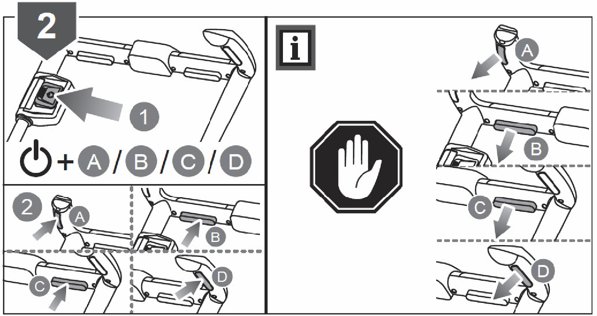
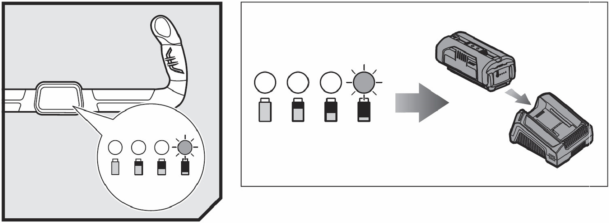
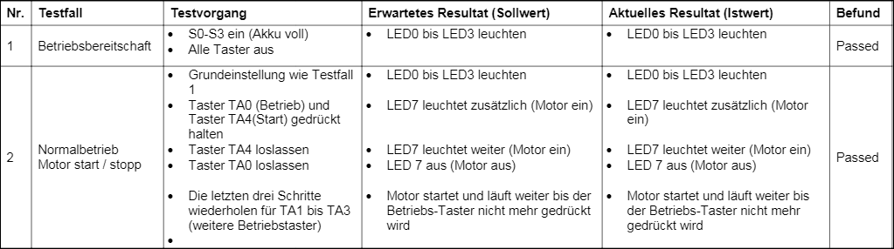
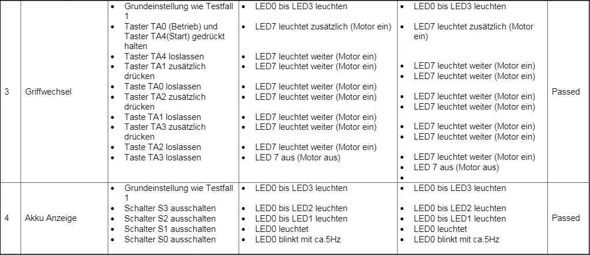
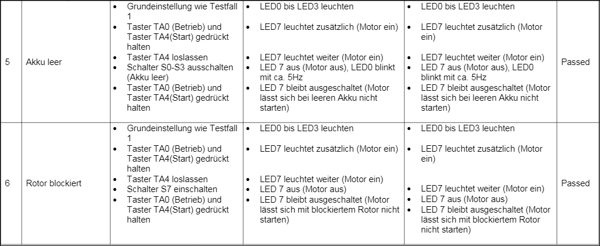

# Akku Rasenmäher

## Aufgabenstellung

Es ist die Steuerung für einen mit Akku betriebenen Rasenmäher der neusten Generation zu programmieren.
Der Akku-Rasenmäher wird mit einem 36V Akku betrieben. Er verfügt über eine Akku-Ladestandsanzeige im Griff und über eine automatische Abschaltung wenn der Rotor blockiert wird.


Das Programm ist wie folgt zu schreiben:

Zum Starten des Rasenmähers muss jeweils die Start-Taste und mindestens einer der vier Betriebs-Tasten (A,B,C,D) gedrückt werden (siehe Abbildung 1). Die Reihenfolge spielt dabei keine Rolle. Der Start-Taster ist mit der Taste TA4 und die vier Betriebs-Taster mit den Tasten TA0 bis TA3 zu simulieren. Zur Anzeige das der Motor läuft, wird die LED 7 eingeschaltet. Nach erfolgtem Start kann die Start-Taste losgelassen werden. Es reicht wenn noch mindestens eine der vier Betriebs-Taster gedrückt wird damit der Motor läuft. Wird keine Betriebs-Taste gedrückt stoppt der Motor (LED7 ausschalten).
Der Motor wird auch gestoppt, wenn der Rotor blockiert wird. Dies soll über den Schalter S7 simuliert werden können (Schalter ein = Rotor blockiert). Wird der Motor blockiert muss er neu gestartet werden.
Die Akku Ladestandsanzeige soll den Akku stand in 25%-Schritten anzeigen (siehe Abbildung 2). Der Akku Ladestand ist mit den Schaltern S0 bis S3 einzulesen. Ein Schalter entspricht dabei 25%. Für den Füllstand 75% müssen also zum Beispiel die Schalter S0 bis S2 eingeschaltet sein. Als Anzeige des Ladestands sollen die LED0 bis LED3 verwendet werden. Für den Füllstand 75% müssen also zum Beispiel die LED0 bis LED2 leuchten. Ist der Akku leer, soll das LED0 mit ca. 5Hz blinken und der Motor soll ausschalten. Ohne den Akku zu laden (mindestens Schalter S0 einschalten) kann der Motor nicht mehr gestartet werden.



Abbildung 1: Bedienung Start-Stopp - Ausschnitt aus der Bedienungsanleitung.



Abbildung 2: Akku-Ladestandsanzeige im Griff - Ausschnitt aus der Bedienungsanleitung.

## Problemanalyse

- Motor wird gestartet wenn die Start-Taste (TA4) zusammen mit mindestens einer Betriebstaste (TA0 – TA3) gedrückt wird.
- Motoranzeige LED7 Motor läuft solange mindestens eine Betriebstaste (TA0 – TA3) gedrückt wird.
- Motor stellt ab wenn der Rotor blockiert S7.
- Motor stellt ab wenn Akku leer Schalter S0-S3 ausgeschaltet.
- Stellt der Motor ab, muss er neu gestartet werden (wieder mit Start-Taste).
- Akku Ladestandsanzeige im 25% Schritt LED0 – LED3.
- Wenn Akku leer S0 Blinkt mit ca. 5Hz 100ms ON/ 100ms OFF.
- Akku Ladestand wird mit den Schaltern S0-S3 simuliert  kein Schalter = leer, alle Schalter = voll.

## Hardwareanalyse

|I/O        |Funktion              |Logik 0                  |Logik 1            |
|:----------|:---------------------|:------------------------|:------------------|
|Schalter S0|Akku Ladestand        |Akku leer                |Akku <= 25% geladen|
|Schalter S1|Akku Ladestand        |Akku <= 25% geladen      |Akku <= 50% geladen|
|Schalter S2|Akku Ladestand        |Akku <= 50% geladen      |Akku <= 75% geladen|
|Schalter S3|Akku Ladestand        |Akku <= 75% geladen      |Akku > 75% geladen |
|Schalter S7|Blockierter Rotor     |Nicht blockiert          |blockiert          |
|Taster TA0 |Betriebstaste A       |Motor stoppt             |Motor Läuft*       |
|Taster TA1 |Betriebstaste B       |Motor stoppt             |Motor Läuft*       |
|Taster TA2 |Betriebstaste C       |Motor stoppt             |Motor Läuft*       |
|Taster TA3 |Betriebstaste D       |Motor stoppt             |Motor Läuft*       |
|LED0       |Akku Ladestandsanzeige|Blinken: Akku leer       |Akku <= 25% geladen|
|LED1       |Akku Ladestandsanzeige|Akku <= 25% geladen      |Akku <= 50% geladen|
|LED2       |Akku Ladestandsanzeige|Akku <= 50% geladen      |Akku <= 75% geladen|
|LED3       |Akku Ladestandsanzeige|Akku <= 75% geladen      |Akku >75% geladen  |
|LED7       |Motor Anzeige         |Motor nicht eingeschaltet|Motor eingeschaltet|

Voraussetzung, dass der Motor läuft ist, dass er zuvor gestartet wurde und kein anderes Ereignis zum stopp führt.

## Softwareanalyse

### Graphische Lösung

Zur Softwareanalyse wird ein Problemorientiertes Struktogramm nach Nasi Schneidermann erstellt.

#### Hauptprogramm


## Source Code

```c

```

## Testprotokoll

Nachfolgend wird das Programm getestet. Dazu wurden Testfälle erstellt mit deren Hilfe das Programm auf seine Funktionstüchtigkeit getestet wird. Entspricht das Aktuelle Resultat dem Erwarteten so ist der Testfall `Passed` ansonsten `Failed`.

### Testablauf





### Testbericht

Alle der oben durchgeführten Testfälle sind erfolgreich verlaufen.  

Das Programm funktioniert fehlerfrei.
